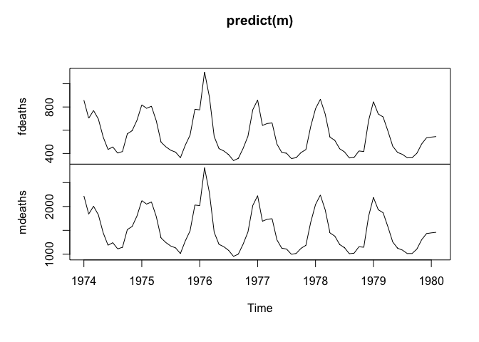
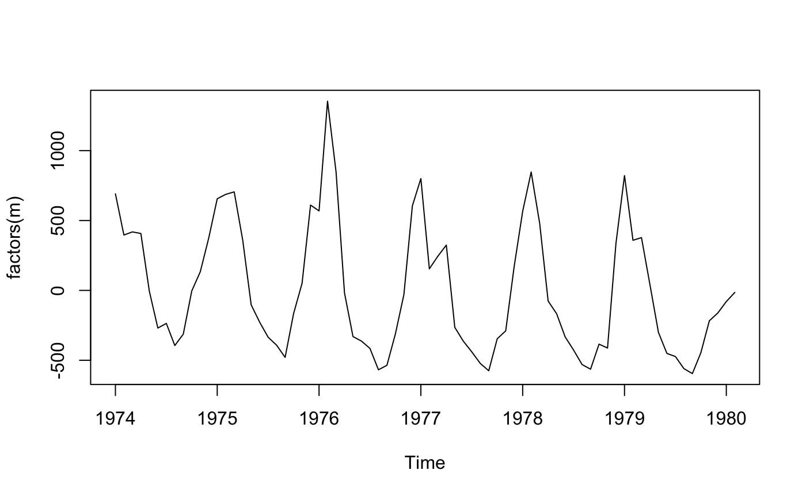

<!-- README.md is generated from README.Rmd. Please edit that file -->
BDFM
====

Bayesian dynamic factor model estimation in R.

[](https://travis-ci.org/srlanalytics/BDFM) [](https://codecov.io/github/srlanalytics/BDFM)

BDFM estimates dynamic factor models by simulation using the Durbin and Koopman (2012) disturbance smoother and returns estimated factors, predicted values of observables, posterior distributions for predicted values (optional), and forecast updates by series (optional). Maximum likelihood estimation via Watson and Engle (1983) is also supported. Input data may be noisy, have missing values, or "ragged edges" due to different start or end dates.

Installation
------------

To install the development version:

``` r
remotes::install_github("srlanalytics/BDFM")
```

Basic Use
---------

Estimate a model with one factor and two lags in the transition equation:

``` r
library(BDFM)
dta <- cbind(fdeaths, mdeaths)
m <- dfm(dta, forecast = 2)
```

Input data should be an object of class `"ts"`. If the [tsbox](https://www.tsbox.help/) package is installed, any ts-boxable time series objects can be supplied, such as `"xts"`, `"zoo"`, `"timeSeries"` or `"data.frame"`.

Extract the resulting series, using `predict()`.

``` r
plot(predict(m))
```



Or have a look at the esimated factors, using `factors()`:

``` r
plot(factors(m))
```



Estimation Details
------------------

You can find details on estimation routines and derivations in the short book *Practical Implementation of Factor Models*. [Free Download](http://srlquantitative.com)
